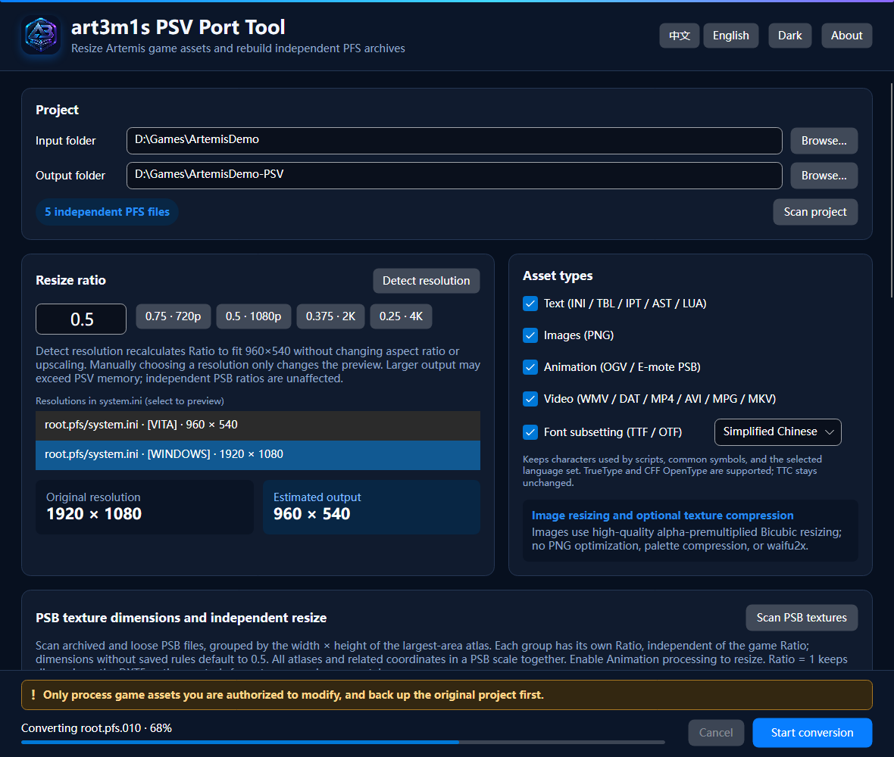

# art3m1s_psv_port_tool

[简体中文](README.md) · [English](README.en.md) · [Changelog](CHANGELOG.md)

[](https://github.com/DeQxJ00/art3m1s_psv_port_tool/actions/workflows/ci.yml)
[](https://github.com/DeQxJ00/art3m1s_psv_port_tool/actions/workflows/release.yml)

A PSV porting assistant for Artemis-engine games. It extracts each physical PFS independently, resizes selected assets, and rebuilds it under the exact same file name. Arbitrarily named loose directories under the game root are copied recursively and their assets are converted by file extension (tested at three levels and with no depth limit in the implementation). The app uses .NET 10, Avalonia 12, C# 14, and NativeAOT on Windows, Linux, and macOS.

> Only process game assets you are authorized to modify, and keep a backup. This tool does not bypass platform signing, licensing encryption, or DRM.

## UI screenshots



[中文深色](docs/screenshots/ui-zh-CN-dark.png) · [English dark](docs/screenshots/ui-en-US-dark.png) · [中文浅色](docs/screenshots/ui-zh-CN-light.png) · [English light](docs/screenshots/ui-en-US-light.png)

## Downloads and platform support

Every release provides two versioned archives for each of `win-x64`, `linux-x64`, `osx-x64`, and `osx-arm64`: `with-ffmpeg` works out of the box, while the smaller `no-ffmpeg` archive requires FFmpeg to be supplied separately. Windows/Linux use a NativeAOT executable with a separate PVRTexLib native library; macOS uses an unsigned and unnotarized `.app.zip` bundle and may require manual approval under Privacy & Security.

### Installing FFmpeg

Video and OGV conversion require both `ffmpeg` and `ffprobe`. The `with-ffmpeg` archive already places them correctly. For a `no-ffmpeg` archive, use a GPL Full build containing libdav1d, libx264, and libtheora, then choose one of these configurations:

- Windows/Linux: create a `tools` folder beside the application and place `ffmpeg.exe` / `ffprobe.exe` (Windows) or `ffmpeg` / `ffprobe` (Linux) inside it. They may also be placed directly beside the application.
- macOS: place both files in `art3m1s_psv_port_tool.app/Contents/MacOS/tools/` and make them executable (`chmod +x ffmpeg ffprobe`).
- Every platform: set `ART3M1S_FFMPEG` and `ART3M1S_FFPROBE` to the full paths of the two executables, or add both to the system `PATH`.

Lookup order is environment variables, the application's `tools` directory, beside the application, then system `PATH`. In the supplied Full packages, Windows/Linux use checksum-verified BtbN n9.0 static binaries and macOS uses an equivalent FFmpeg 9.0.2 source build. No nonfree components are enabled.

## Usage

1. Select a game root containing `xxxxx.pfs` and a different output directory.
2. Click “Scan project” to verify the independent PFS count, or “Detect resolution” to list all INI resolutions and select one for the preview.
3. Set Ratio and select Text, Images, Animation, and Video.
4. Start conversion. If output exists, click Start once more to confirm replacement.

The converter writes to a dedicated sibling staging directory and replaces the destination only after every operation succeeds. Cancellation or failure removes temporary output.

## Ratio and PSV resolution guidance

The default is `0.5`; valid input is `0 < Ratio ≤ 1`. Presets are `0.75 · 720p`, `0.5 · 1080p`, `0.375 · 2K`, and `0.25 · 4K`. Aim for “game resolution × Ratio” near PSV `960×540` (or `960×544`). Larger images can exhaust PSV memory. “Detect resolution” lists every complete width/height pair from loose and PFS-contained `system.ini` files, showing the source and section. It initially selects `[WINDOWS]` in the first valid INI, or that INI's first pair; choose another item to change the preview. Only the PFS index and matching entry are read; archives are not fully extracted. If detection fails, inspect a PNG under extracted `image/bg`. Detection computes `Ratio = min(1, 960/width, 540/height)` from the default-selected resolution, preserving aspect ratio, fitting 960×540 and avoiding upscaling; for example 1920×1080 → 0.5 and 1280×720 → 0.75. Missing dimensions leave the current Ratio unchanged. Manually choosing a list entry only updates the preview; Ratio remains editable. Independent PSB ratios are unaffected. Resolution and PSB scans keep the main viewport in place, with auto-scroll confined to the log's internal viewport.

## Asset processing rules

The “PSB texture dimensions and independent resize” section has its own scan button. It reads embedded texture metadata from loose and archived PSB files and groups them by the complete **width × height**, so `4096 × 2048` and `2048 × 4096` are separate groups. A multi-atlas PSB is grouped by its largest-area atlas; details list every atlas dimension. Each group accepts presets or custom `0 < Ratio ≤ 1`, defaults to `0.5`, is independent of the game Ratio, and is saved in settings. Dimensions without a saved rule default to `0.5`. All atlases and related coordinates in a PSB use the group's uniform ratio. Enable Animation processing to resize; `1` keeps dimensions. DXT5 compression remains a separate option. Scan failures include the file path and reason in the log. No dimension/Ratio rows appear before scanning; only discovered groups are listed afterwards. Rescanning replaces old results and changing the input folder clears the list. Saved ratios remain intact and are restored when the same width/height is found.

- Text: exactly reproduces VisualNovelUpscaler's Artemis matching, truncation, encoding, and output behavior for INI / TBL / IPT / AST / LUA. IET is copied unchanged. For E-mote, X/Y offsets and canvas dimensions in TBL pose tables, AST coordinates, and literal LUA `mulpos()` coordinates are scaled together; character scale factors, actions, faces, lip-sync samples, and resource names remain unchanged.
- Images: high-quality alpha-premultiplied ImageSharp Bicubic resizing. Retained PNGs have no PNG optimization, palette compression or waifu2x; native texture encoding is a separate lossy option.
- Animation: Bicubic OGV resize through FFmpeg; each target dimension is truncated as `int(original dimension × Ratio)`, matching VisualNovelUpscaler, while frame rate and audio are retained. Artemis/E-mote dynamic-portrait PSB containers (v1–v4) are parsed and rebuilt: embedded `RGBA8` / `DXT5` atlases use Bicubic Ratio resizing, while texture/truncation dimensions, icon rectangles, origins, screenSize, motion coordinates, offsets, paths, blank-mesh domains, and resource tables are updated together. Angles, timing, scale factors, curves, and parameter ranges remain unchanged. The independent “Convert E-mote PSB textures to DXT5 (BC3)” option is enabled by default. After resizing, it converts the BGRA-byte-order RGBA8 atlas in a motion PSB to raw 4×4 BC3 blocks without a DDS header or PSV swizzle, and updates the texture type and resource tables. Existing DXT5 is not recompressed when no resize is needed. Disabling the option preserves the existing resize behavior and texture format. The same logic applies to loose and PFS-contained PSB files. PSB processing is serialized to control peak memory. BC3 reduces resource data, memory, and transfer volume: a 3072×1536 atlas falls from 18 MiB RGBA to 4.5 MiB BC3 data, with an estimated 8 MiB texture allocation under the current native GXM alignment. Initial-load and sustained-frame-rate gains have not been quantified.
- Video: “Ignore video inside PFS (WMV / DAT / MP4 / AVI / MPG / MKV)” is enabled by default. Matching PFS entries retain their original names and bytes and are never passed to FFmpeg. OGV is not covered by this option and is still processed as animation. When the option is disabled, supported PFS video can be processed, while archived DAT remains unchanged because it may contain ordinary data such as font caches. Loose WMV / DAT / MP4 / AVI / MPG / MKV videos outside PFS are all emitted as same-stem MP4 files using H.264 Main@3.1 and AAC. DAT video uses a fixed 960×544 output; other containers use Ratio-based dimension truncation. DAT files without a detectable video stream remain unchanged.
- Fonts (optional): TTF and OTF are supported. TrueType `glyf` fonts use the built-in conservative subsetter, while CFF OpenType fonts use HarfBuzz. The selected common Simplified Chinese, Japanese, or Traditional Chinese range is retained together with all script-used characters, ASCII, common punctuation, and full-width/half-width symbols. TTC remains unchanged to avoid corruption.
- Unselected asset types are copied byte-for-byte.

Default parallelism is `max(1, logical CPU count - 1)`. OGV animation is always converted one file at a time with one FFmpeg thread; other video jobs are limited to two at once.

### PSB DXT5 GPU memory and why compress

RGBA8 uses 4 bytes per pixel; DXT5 (BC3) uses 16 bytes per `4×4` block and supports interpolated alpha. Pixel-data sizes are `width × height × 4` and `ceil(width/4) × ceil(height/4) × 16`, respectively, making DXT5 data approximately one quarter of RGBA8 at the same dimensions. Both color and alpha are approximated lossily, not preserved losslessly. [Format reference: Microsoft Learn](https://learn.microsoft.com/en-us/windows/win32/direct3d11/texture-block-compression-in-direct3d-11).

This is more than a smaller disk file: the current Art3m1sPSV native BC3 path uploads compressed blocks for GPU sampling without a full RGBA pixel mirror, reducing texture storage and transfers. Resizing compounds the savings, but higher frame rates are not guaranteed. Falling back to RGBA decoding on an unsupported engine may remove the GPU-memory benefit.

| Atlas dimensions / Ratio | RGBA8 data | DXT5 data | Current GXM DXT5 allocation estimate |
| --- | ---: | ---: | ---: |
| 4096 × 2048 / 1 | 32 MiB | 8 MiB | 8 MiB |
| 3072 × 1536 / 0.75 | 18 MiB | 4.5 MiB | 8 MiB |
| 2048 × 1024 / 0.5 | 8 MiB | 2 MiB | 2 MiB |
| 1024 × 512 / 0.25 | 2 MiB | 0.5 MiB | 0.5 MiB |

All ratios above refer to an original `4096 × 2048` atlas. The current engine rounds BC3 storage dimensions up to powers of two (minimum 4), aligns RGBA row stride to 8 pixels, and rounds each texture allocation up to **256 KiB**. Non-power-of-two dimensions therefore cannot use “1 byte per pixel” as actual GPU memory. Small textures can allocate at least 0.25 MiB in either format, eliminating allocation savings.

Each UI row compares the group's **single largest atlas** at the selected Ratio. It is not measured GPU usage for the chosen output format, the whole PSB, or all scanned files. Sum only the atlases actually loaded together; caches, render targets and temporary memory are extra. Estimates cover the current native GXM path for atlases up to 4096 without mipmaps, not other engines or fallback paths. `1 MiB = 1024 × 1024` bytes.

## PNG palette and transparency guarantees

These guarantees apply to images retained as PNG.

RGB24 stays RGB24 without Alpha; RGBA, grayscale, and transparent grayscale retain their color type. Gray8 PNG masks are forced to remain 8-bit grayscale (PNG color type 0) and are never converted to RGB, RGBA, or grayscale-alpha. Indexed PNGs keep their original 1/2/4/8-bit depth. Original `PLTE` and `tRNS` chunks are written back byte-for-byte—the built-in palette is never edited, reordered, or reduced. Bicubic pixels are mapped back to the original palette and only pixel indices change. PNG coordinate text is scaled; every other PNG chunk is retained byte-for-byte apart from dimensions and image data.

## Build, tests, and GitHub Actions

.NET SDK 10.0.303 is required:

```powershell
dotnet restore art3m1s_psv_port_tool.slnx
dotnet test art3m1s_psv_port_tool.slnx -c Release
dotnet publish src/Art3m1s.PsvTool.App -c Release -r win-x64
./scripts/generate-screenshots.ps1
```

`ci.yml` checks Release builds, tests, formatting, screenshot baselines, and multi-platform NativeAOT. For `v*` tags or manual runs, `release.yml` builds all four targets and publishes versioned `with-ffmpeg` / `no-ffmpeg` archives for each platform, plus checksums, SBOM, licenses, and FFmpeg build/source information.

For each new version, update `CHANGELOG.md`, `Directory.Build.props`, and macOS `Info.plist` before creating the matching `v*` tag. CI/Release runs `scripts/check-changelog.ps1` to verify the versions and changelog entry.

## Known limitations

- The first macOS release is unsigned and unnotarized.
- Unsupported video container/codec combinations stop with the original FFmpeg diagnostic instead of silently degrading.
- pf2/pf6 can be read, while rebuilt files are pf8. Individual PFS entries over 4 GiB are unsupported.
- PSB rebuilding currently supports plaintext bodies and encrypted headers whose key can be inferred automatically. Encrypted bodies, external textures, and atlas formats other than `RGBA8` / `DXT5` fail explicitly instead of being silently copied as “converted.” DXT5 re-encoding is lossy block compression.
- Automatic text rules target common Artemis scripts; verify subtitles, hit areas, and animation coordinates in the actual game.

## Native PSV textures

The texture conversion master option is disabled by default; enable it when needed. Keep it disabled for resources shared with other platforms or original engines. It requires a version of Art3m1sPSV with native DDS/PVR loading support. Scan all valid `.pfs` / `.pfs.xxx` archives, including subdirectories, and loose images to populate directory categories. After enabling the master option, only color BG is selected by default. Grayscale is listed separately and kept by default; other categories are unchecked.

Each category offers automatic, original, or explicit formats. Dropdown entries show unsuitable counts and reasons based on alpha, channels, metadata, name collisions and scaled dimensions. Incompatible selections are kept and reported. Automatic chooses BC1 for opaque color BG/CG/sprites, BC3 for transparency, and preserves grayscale/UI/unknown categories. An independent, default-off option discards BG alpha during conversion.

| Format | Bits/pixel | Channels / alpha |
| --- | ---: | --- |
| BC1 / DXT1 | 4 | RGB + binary alpha |
| BC2 / DXT3 | 8 | RGB + 4-bit alpha |
| BC3 / DXT5 | 8 | RGB + interpolated alpha |
| BC4 UNORM / SNORM | 4 | R, no separate alpha |
| BC5 UNORM / SNORM | 8 | RG, no blue or separate alpha |
| PVRTC1 RGB / RGBA 2bpp | 2 | RGB or RGBA |
| PVRTC1 RGB / RGBA 4bpp | 4 | RGB or RGBA |
| PVRTC2 2bpp / 4bpp | 2 / 4 | RGBA |
| ETC1 | 4 | RGB, no alpha |

BC4 can be explicitly selected for opaque grayscale data; BC5 and signed formats are unsuitable for ordinary images. PVRTC1 requires power-of-two output dimensions, without automatic stretching. ETC1 currently has Vita3K compatibility issues. Output is limited to 4096 per dimension, with no mipmaps. Estimates include block alignment and headers, but retained images use original sizes and GPU allocation has additional overhead. Compressed files may exceed PNG sizes.

BC outputs DDS; PVRTC/ETC1 outputs PVR. PFS filename encoding is preserved while changing extensions, using the engine's PNG-to-native lookup. Metadata-bearing PNGs remain PNG to retain offsets/crop information. Existing native textures, conflicting names, duplicate virtual paths and unreadable images are kept. Existing PSB processing remains independent. Keep the supplied PVRTexLib native library and license files with the executable.

## Credits

Thanks to the following open-source projects.

| Project | License | Use in this project | Source |
|---|---|---|---|
| **pfs_upk** | GPL-3.0 | Reference for pf2 / pf6 / pf8 formats and pack/unpack behavior | [nextgal/pfs_upk@abdffcb](https://github.com/nextgal/pfs_upk/tree/abdffcbeb3c733ce234aa99ed42b206d13aaed2f) |
| **art3m1s-core** | MPL-2.0 | Reference for E-mote PSB v1–v4 structure, encrypted headers, objects, and resource tables | [Alphaly2K/art3m1s-core@0c06f37](https://github.com/Alphaly2K/art3m1s-core/tree/0c06f37160961c9ff75d4937d5e6bb0500d0bef9) |
| **VisualNovelUpscaler** | MIT | Reference for Artemis text coordinates, sizes, and Ratio rules | [hokejyo/VisualNovelUpscaler@d755913](https://github.com/hokejyo/VisualNovelUpscaler/tree/d755913eb72f739ad4faea70e689cf933ba54c7f) |
| **Avalonia** | MIT | Cross-platform desktop UI (12.1.2) | [AvaloniaUI/Avalonia](https://github.com/AvaloniaUI/Avalonia) |
| **PVRTexLib.NET / PVRTexLib** | MIT wrapper / PowerVR Tools EULA | Native texture encoding | [PVRTexLib.NET](https://github.com/YingFengTingYu/PVRTexLib.NET) · [PowerVR EULA](https://developer.imaginationtech.com/terms/software-end-user-licence-agreement/) |
| **SixLabors.ImageSharp** | Six Labors Split License 1.0 | PNG decoding and Bicubic resizing (3.1.12) | [SixLabors/ImageSharp](https://github.com/SixLabors/ImageSharp) |
| **HarfBuzz** | Old MIT | CFF OpenType font subsetting (8.3.1) | [harfbuzz/harfbuzz](https://github.com/harfbuzz/harfbuzz) |
| **Optris.StaticGraphics.Avalonia.Software** | MIT fork and upstream component licenses | Static Skia / HarfBuzz graphics backend for NativeAOT | [NuGet](https://www.nuget.org/packages/Optris.StaticGraphics.Avalonia.Software) |
| **FFmpeg / ffprobe** | GPL Full build | Animation/video probing, resizing, and transcoding (n9.0 / 9.0.2) | [FFmpeg 9.0.2 source](https://ffmpeg.org/releases/ffmpeg-9.0.2.tar.xz) |
| **BtbN/FFmpeg-Builds** | GPL-3.0 | Windows/Linux FFmpeg Full static binaries and provider checksums | [BtbN/FFmpeg-Builds](https://github.com/BtbN/FFmpeg-Builds) |
| **dav1d** | BSD-2-Clause | Software AV1 decoding | [VideoLAN/dav1d](https://code.videolan.org/videolan/dav1d) |
| **x264** | GPL-2.0 | H.264 encoding | [VideoLAN/x264](https://code.videolan.org/videolan/x264) |
| **libtheora** | BSD-3-Clause | Theora encoding | [Xiph.Org/libtheora](https://github.com/xiph/theora) |
| **libogg** | BSD-3-Clause | Ogg container | [Xiph.Org/libogg](https://github.com/xiph/ogg) |
| **zlib** | Zlib | PNG frame-sequence compression | [zlib](https://zlib.net/) |

This product includes components of the PowerVR Tools Software from Imagination Technologies Limited.
