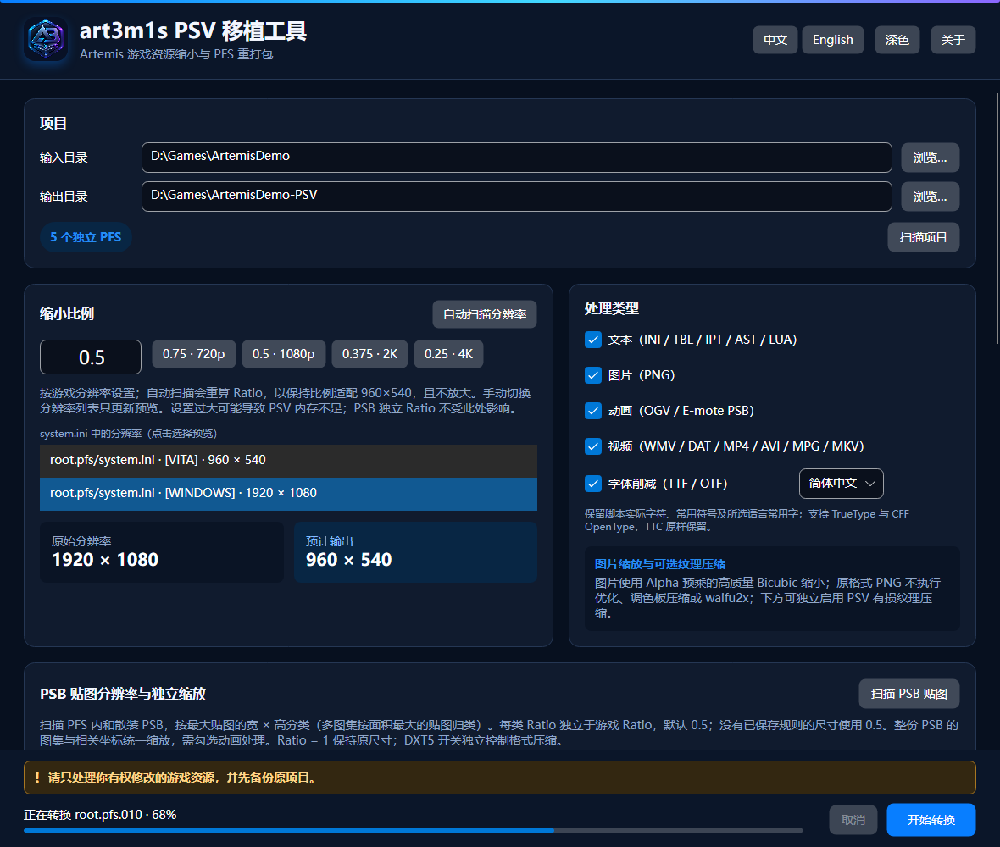

# art3m1s_psv_port_tool

[简体中文](README.md) · [English](README.en.md) · [更新日志](CHANGELOG.md)

[](https://github.com/DeQxJ00/art3m1s_psv_port_tool/actions/workflows/ci.yml)
[](https://github.com/DeQxJ00/art3m1s_psv_port_tool/actions/workflows/release.yml)

面向 Artemis 引擎游戏的 PSV 移植辅助工具。它逐个解包物理 PFS、按选择缩小资源，再以相同文件名重新打包；根目录下 PFS 之外任意名称的文件夹也会完整递归复制，并按文件扩展名转换其中资源（至少覆盖 3 层，实际不限制深度）。应用使用 .NET 10、Avalonia 12、C# 14 与 NativeAOT，支持 Windows、Linux 和 macOS。

> 请只处理你有权修改的游戏资源，并先备份原项目。工具不绕过平台签名、加密授权或 DRM。

## UI 截图



[中文深色](docs/screenshots/ui-zh-CN-dark.png) · [English dark](docs/screenshots/ui-en-US-dark.png) · [中文浅色](docs/screenshots/ui-zh-CN-light.png) · [English light](docs/screenshots/ui-en-US-light.png)

## 下载与平台支持

Release 为 `win-x64`、`linux-x64`、`osx-x64` 和 `osx-arm64` 各提供两种带版本号的压缩包：`with-ffmpeg` 包可直接使用，`no-ffmpeg` 包更小、需要自行放置 FFmpeg。Windows/Linux 为 NativeAOT 单文件，macOS 为未签名、未公证的 `.app.zip`；macOS 首次启动可能需要在“隐私与安全性”中手动允许。

### FFmpeg 放置方法

视频和 OGV 转换需要同时提供 `ffmpeg` 与 `ffprobe`。下载 `with-ffmpeg` 包时两者已位于正确位置；下载 `no-ffmpeg` 包时，请使用包含 libdav1d、libx264 和 libtheora 的 GPL Full 构建，并按以下任一方式配置：

- Windows/Linux：在程序所在目录新建 `tools`，放入 `ffmpeg.exe` / `ffprobe.exe`（Windows）或 `ffmpeg` / `ffprobe`（Linux）。也可以直接放在主程序旁。
- macOS：放入 `art3m1s_psv_port_tool.app/Contents/MacOS/tools/`，并为两个文件增加可执行权限（`chmod +x ffmpeg ffprobe`）。
- 所有平台：可分别设置 `ART3M1S_FFMPEG` 和 `ART3M1S_FFPROBE` 为两个程序的完整路径，或把二者加入系统 `PATH`。

查找顺序为环境变量、程序目录的 `tools`、主程序旁、系统 `PATH`。项目提供的 Full 包中，Windows/Linux 使用经校验的 BtbN n9.0 静态二进制，macOS 使用 FFmpeg 9.0.2 等价源码构建；均不包含 nonfree 组件。

## 使用步骤

1. 选择包含 `xxxxx.pfs` 的游戏根目录与不同的输出目录。
2. 点击“扫描项目”确认独立 PFS 数量；也可点击“自动扫描分辨率”，查看所有 INI 分辨率并选择一组预览。
3. 设置 Ratio，勾选文本、图片、动画和视频类型。
4. 开始转换；输出目录已存在时需要再次点击确认覆盖。

转换先写入输出目录同级的专用临时目录，全部成功后再替换目标；取消或失败会清理临时结果。

## Ratio 与 PSV 分辨率建议

默认 `0.5`，允许输入 `0 < Ratio ≤ 1`。参考按钮为 `0.75 · 720p`、`0.5 · 1080p`、`0.375 · 2K`、`0.25 · 4K`。以“原游戏分辨率 × Ratio”接近 PSV 的 `960×540`（或 `960×544`）为宜；设置过大会增加显存和内存压力。“自动扫描分辨率”列出游戏根目录及所有 PFS 内 `system.ini` 的完整宽高，标明来源和段落；默认优先选择首个有效 INI 的 `[WINDOWS]`，否则选其第一组，点击其他项可切换预览。扫描只读取 PFS 索引和目标条目，不解包整个归档；仍无法识别时可参考解包后的 `image/bg` PNG。点击自动扫描后，会按默认选中的宽高计算 `Ratio = min(1, 960/宽, 540/高)`，保持长宽比、适配 960×540，且不放大；例如 1920×1080 → 0.5、1280×720 → 0.75。未找到有效宽高时保留当前 Ratio。手动切换列表仅更新预览，可直接修改 Ratio。独立 PSB 比例不受影响。分辨率和 PSB 扫描均保留主页面滚动位置，日志只在框内自动滚动到底部。

## 资源处理规则

“PSB 贴图分辨率与独立缩放”提供单独的扫描按钮：读取 PFS 内及散装 PSB 的内嵌贴图元数据，按完整的 **宽 × 高** 分类，如 `4096 × 2048` 与 `2048 × 4096` 是两类。多图集 PSB 按面积最大的贴图分类，详情会列出全部图集尺寸。每类可选择预设或手动输入 `0 < Ratio ≤ 1`，默认 `0.5`，独立于上方游戏 Ratio；配置会保存。没有已保存规则的尺寸默认 `0.5`。整份 PSB 的图集与相关坐标使用该类同一比例，需勾选动画处理；设为 `1` 保持尺寸。DXT5 开关继续独立控制格式压缩。扫描失败的具体文件与原因显示在日志中。扫描前不显示任何尺寸/Ratio 行；扫描后仅列出实际发现的分类。重新扫描替换旧结果，切换输入目录清空列表；已保存的比例不会因此删除，匹配到相同宽高时自动恢复。

- 文本：INI / TBL / IPT / AST / LUA 严格复刻 VisualNovelUpscaler 的 Artemis 匹配、取整、编码与输出行为；IET 原样复制。E-mote 会额外同步缩放 TBL 姿态表中的 X/Y 偏移与画布宽高、AST 坐标以及 LUA 的固定 `mulpos()` 坐标；人物缩放倍率、动作、表情、口型采样和资源名保持不变。
- 图片：PNG 使用 ImageSharp 的 Alpha 预乘高质量 Bicubic，默认缩放；保留 PNG 时不进行 PNG 优化、调色板压缩或 waifu2x。下方 PSV 纹理选项可启用有损压缩。
- 动画：OGV 使用 FFmpeg Bicubic；目标宽高与 VisualNovelUpscaler 一样分别按 `int(原尺寸 × Ratio)` 截断，保持帧率与音频。Artemis／E-mote 动态立绘 PSB（v1–v4）会解析内嵌 `RGBA8` / `DXT5` atlas，以 Bicubic 按 Ratio 缩小并重建资源表，同时缩放 texture 尺寸、裁切尺寸、icon 矩形、origin、screenSize、动作坐标、偏移、运动路径与空白网格域；角度、动作时间、缩放倍率、曲线和参数范围保持不变。独立的“E-mote PSB 纹理转 DXT5（BC3）”默认开启：缩放完成后将 motion PSB 的 BGRA 字节序 RGBA8 图集编码成无 DDS 头、无 PSV swizzle 的原始 4×4 BC3 块，并更新纹理类型与资源表；已有 DXT5 且无需缩放时不会重复压缩。关闭后维持原有缩放与纹理格式。PSB 内外及 PFS 内均使用相同逻辑。为控制峰值内存，PSB 固定逐个处理。BC3 的收益是减少资源数据、内存和传输量；例如 3072×1536 RGBA 数据由 18 MiB 降为 4.5 MiB，当前原生 GXM 路径对齐后的纹理分配估计为 8 MiB。首次加载速度与持续帧率收益未量化。
- 视频：默认勾选“忽略 PFS 内的视频（WMV / DAT / MP4 / AVI / MPG / MKV）”，这些 PFS 条目保持原文件名和原始字节，不交给 FFmpeg；OGV 不在此忽略范围内，仍按动画规则处理。取消勾选后可处理 PFS 内受支持的视频，但 PFS 内 DAT 仍因可能是字体缓存等普通数据而原样保留。PFS 外散装目录中的 WMV / DAT / MP4 / AVI / MPG / MKV 视频统一输出为同名 MP4（H.264 Main@3.1、AAC）；除 DAT 固定为 960×544 外，其余格式使用 Ratio 尺寸截断规则。无法检测到视频流的普通数据 DAT 原样保留。
- 字体（可选）：支持 TTF 与 OTF。TrueType `glyf` 字体使用内置保守削减器，CFF OpenType 字体使用 HarfBuzz 子集器；按简体中文、日文或繁体中文常用范围裁剪，同时始终保留脚本中实际出现的字符、ASCII、常用标点与全角/半角符号。TTC 为避免损坏会原样保留。
- 未勾选类型按字节复制，不执行转换。

并行度默认为 `max(1, CPU 逻辑核心数 - 1)`；OGV 动画固定逐个单线程转换，其他视频任务最多同时两个。

### PSB DXT5 显存占用与压缩原因

RGBA8 每像素 4 字节；DXT5（BC3）每个 `4×4` 像素块占 16 字节，支持渐变透明。图集像素数据大小分别为 `宽 × 高 × 4` 和 `ceil(宽/4) × ceil(高/4) × 16`，所以通常同尺寸 DXT5 数据约为 RGBA8 的四分之一。它是有损压缩，颜色和 Alpha 都是近似值，不是无损保留透明度。[格式说明：Microsoft Learn](https://learn.microsoft.com/en-us/windows/win32/direct3d11/texture-block-compression-in-direct3d-11)。

这不仅是缩小磁盘文件：当前 Art3m1sPSV 的原生 BC3 路径直接上传压缩块并由 GPU 采样，不保存完整 RGBA 像素副本，主要为节省纹理显存和传输量。与缩小分辨率结合后收益更大，但不保证提高帧率；不支持原生 BC3 而回退为 RGBA 解码时，显存收益可能消失。

| 图集尺寸 / Ratio | RGBA8 数据 | DXT5 数据 | 当前 GXM DXT5 分配估计 |
| --- | ---: | ---: | ---: |
| 4096 × 2048 / 1 | 32 MiB | 8 MiB | 8 MiB |
| 3072 × 1536 / 0.75 | 18 MiB | 4.5 MiB | 8 MiB |
| 2048 × 1024 / 0.5 | 8 MiB | 2 MiB | 2 MiB |
| 1024 × 512 / 0.25 | 2 MiB | 0.5 MiB | 0.5 MiB |

以上 Ratio 均相对于 `4096 × 2048` 原图。当前引擎的 BC3 存储宽高分别向上补至 2 的幂（最小 4），RGBA 行宽对齐到 8 像素，单次纹理内存分配均向上对齐到 **256 KiB**。因此非 2 的幂尺寸不能直接按“每像素 1 字节”当作实际显存；小贴图的 RGBA8 和 DXT5 都可能至少分配 0.25 MiB，格式压缩不一定减少分配量。

软件分组行显示的是所选 Ratio 下**单张最大图集**的 RGBA8 / DXT5 对比，不是所选输出格式的实测显存，也不是整份 PSB 或所有扫描文件的总占用。多图集只按实际同时加载的纹理逐张累加，缓存、渲染目标和临时内存等另计。此估算针对当前原生 GXM 路径、尺寸不超过 4096 且不含 mipmap 的图集；其他引擎或回退路径可能不同。`1 MiB = 1024 × 1024` 字节。

## PSV 原生压缩纹理

“图片压制为 PSV 专用纹理”总开关默认关闭，需要时手动勾选；若同一份资源还要给其他平台或原版引擎使用，请保持关闭。需要包含 DDS/PVR 加载支持的 Art3m1sPSV 版本；这不是所有原版 PSV 引擎通用的转换。

点击“扫描图片分类”读取全部有效 `.pfs` / `.pfs.xxx`（含子目录）及散装 PNG/JPEG/DDS/PVR。按真实目录生成分类，列出数量、透明度、文件和估计大小。只有彩色 BG 默认勾选；灰度独立归类、不勾选并推荐保留，其他分类默认不勾选。每类可选自动、保留或具体格式。下拉框按实际图片及缩放后的尺寸标注“不适合 X/N 张”和原因；这些图片在转换时保留并记录原因，不强制丢弃通道。

自动策略：彩色背景/CG/立绘不透明用 BC1，有透明用 BC3；灰度、UI、未知目录和已有原生纹理保留。“转换 BG 时忽略透明度”独立可选，默认关闭；开启会丢弃 BG 的 Alpha。与引擎运行时设置不同，它会改变输出资源本身。

| 格式 | 位/像素 | 通道/透明度 |
| --- | ---: | --- |
| BC1 / DXT1 | 4 | RGB + 二值 Alpha |
| BC2 / DXT3 | 8 | RGB + 4-bit Alpha |
| BC3 / DXT5 | 8 | RGB + 插值 Alpha |
| BC4 UNORM / SNORM | 4 | 单通道 R，无独立 Alpha |
| BC5 UNORM / SNORM | 8 | RG，无蓝色或独立 Alpha |
| PVRTC1 RGB / RGBA 2bpp | 2 | RGB 或 RGBA |
| PVRTC1 RGB / RGBA 4bpp | 4 | RGB 或 RGBA |
| PVRTC2 2bpp / 4bpp | 2 / 4 | RGBA |
| ETC1 | 4 | RGB，无 Alpha |

BC4 只适合显式选择的无透明灰度数据；普通图片的 BC5/有符号格式会标为不适合。PVRTC1 要求缩放后的尺寸为二次幂；不会自动拉伸。ETC1 实机支持，但当前 Vita3K 存在兼容问题。尺寸上限 4096，不生成 mipmap。估计包含块对齐和容器头，保留项暂按原文件大小计算；实际显存有额外对齐/分配开销，输出也不保证小于 PNG。

转换后 BC 使用 DDS、PVRTC/ETC1 使用 PVR，更新 PFS 原始名称的后缀而保留编码，脚本的 PNG 引用由引擎同名查找兼容。重复虚拟路径、同名后缀冲突、已存在的目标和无法检查的图片会保留。带 PNG 文本、偏移、裁剪或未知附加块的图片保留为 PNG，并沿用原 PNG 缩放规则，不丢弃定位信息。PSB 的内嵌图集继续由独立 E-mote 选项处理。

发布包须保留随附的 PVRTexLib 原生库（Windows `PVRTexLib.dll`、Linux `libPVRTexLib.so`、macOS `libPVRTexLib.dylib`）和许可文件。

## PNG 颜色表与透明度保证

以下适用于保留 PNG 格式的图片。


RGB24 输出仍为 RGB24，不增加 Alpha；RGBA、灰度、透明灰度保持颜色类型。遮罩使用的 Gray8 PNG 强制保持 8-bit 灰度（PNG color type 0），不会转成 RGB、RGBA 或灰度透明格式。索引色保持原 1/2/4/8-bit 位深，原 `PLTE` 与 `tRNS` 块逐字节写回，不修改、重排或删减自带颜色表。Bicubic 结果仅映射回原颜色表并重写像素索引。PNG 坐标文本按 Ratio 缩放；除图像尺寸、像素数据和坐标文本外，其余 PNG 块逐字节保留。

## 构建、测试和 GitHub Actions

需要 .NET SDK 10.0.303：

```powershell
dotnet restore art3m1s_psv_port_tool.slnx
dotnet test art3m1s_psv_port_tool.slnx -c Release
dotnet publish src/Art3m1s.PsvTool.App -c Release -r win-x64
./scripts/generate-screenshots.ps1
```

`ci.yml` 执行 Release 编译、测试、格式、截图基线与多平台 NativeAOT 检查；`release.yml` 在 `v*` 标签或手动触发时构建四个平台，并为每个平台发布带版本号的 `with-ffmpeg` / `no-ffmpeg` 压缩包、校验和、SBOM、许可与 FFmpeg 构建信息。

发布新版本时同步更新 `CHANGELOG.md`、`Directory.Build.props` 和 macOS `Info.plist`，然后打相同版本的 `v*` 标签；CI/Release 会运行 `scripts/check-changelog.ps1` 检查版本与日志条目。

## 已知限制

- macOS 首版不签名、不公证。
- 无法由容器和原编码支持的音视频流会报告 FFmpeg 原始诊断并停止，不会静默降级。
- pf2/pf6 可读取，但重新打包统一输出 pf8；超 4 GiB 的单个 PFS 条目不支持。
- 当前 PSB 重建支持明文正文以及可自动推导密钥的加密头；加密正文、外置纹理和 `RGBA8` / `DXT5` 以外的 atlas 格式会明确报错，不会静默复制成“已转换”。DXT5 会重新编码，属于有损块压缩。
- 自动文本规则面向常见 Artemis 脚本，发布前仍应在真实游戏中检查字幕、点击区域与动画坐标。

## Credits

感谢以下开源项目。

| 项目 | 许可证 | 在本项目中的用途 | 来源 |
|---|---|---|---|
| **pfs_upk** | GPL-3.0 | pf2 / pf6 / pf8 格式及打包、解包行为参考 | [nextgal/pfs_upk@abdffcb](https://github.com/nextgal/pfs_upk/tree/abdffcbeb3c733ce234aa99ed42b206d13aaed2f) |
| **art3m1s-core** | MPL-2.0 | E-mote PSB v1–v4 结构、加密头、对象及资源表解析参考 | [Alphaly2K/art3m1s-core@0c06f37](https://github.com/Alphaly2K/art3m1s-core/tree/0c06f37160961c9ff75d4937d5e6bb0500d0bef9) |
| **VisualNovelUpscaler** | MIT | Artemis 文本坐标、尺寸与 Ratio 处理规则参考； | [hokejyo/VisualNovelUpscaler@d755913](https://github.com/hokejyo/VisualNovelUpscaler/tree/d755913eb72f739ad4faea70e689cf933ba54c7f) |
| **Avalonia** | MIT | 跨平台桌面 UI（12.1.2） | [AvaloniaUI/Avalonia](https://github.com/AvaloniaUI/Avalonia) |
| **PVRTexLib.NET / PVRTexLib** | MIT wrapper / PowerVR Tools EULA | GXM 纹理编码 | [PVRTexLib.NET](https://github.com/YingFengTingYu/PVRTexLib.NET) · [PowerVR EULA](https://developer.imaginationtech.com/terms/software-end-user-licence-agreement/) |
| **SixLabors.ImageSharp** | Six Labors Split License 1.0 | PNG 解码与 Bicubic 缩放（3.1.12） | [SixLabors/ImageSharp](https://github.com/SixLabors/ImageSharp) |
| **HarfBuzz** | Old MIT | CFF OpenType 字体削减（8.3.1） | [harfbuzz/harfbuzz](https://github.com/harfbuzz/harfbuzz) |
| **Optris.StaticGraphics.Avalonia.Software** | MIT fork 及上游组件许可证 | NativeAOT 静态 Skia / HarfBuzz 图形后端 | [NuGet](https://www.nuget.org/packages/Optris.StaticGraphics.Avalonia.Software) |
| **FFmpeg / ffprobe** | GPL Full 构建 | 动画与视频探测、缩放及转码（n9.0 / 9.0.2） | [FFmpeg 9.0.2 源码](https://ffmpeg.org/releases/ffmpeg-9.0.2.tar.xz) |
| **BtbN/FFmpeg-Builds** | GPL-3.0 | Windows/Linux FFmpeg Full 静态二进制与官方校验和 | [BtbN/FFmpeg-Builds](https://github.com/BtbN/FFmpeg-Builds) |
| **dav1d** | BSD-2-Clause | AV1 软件解码 | [VideoLAN/dav1d](https://code.videolan.org/videolan/dav1d) |
| **x264** | GPL-2.0 | H.264 编码 | [VideoLAN/x264](https://code.videolan.org/videolan/x264) |
| **libtheora** | BSD-3-Clause | Theora 编码 | [Xiph.Org/libtheora](https://github.com/xiph/theora) |
| **libogg** | BSD-3-Clause | Ogg 容器 | [Xiph.Org/libogg](https://github.com/xiph/ogg) |
| **zlib** | Zlib | PNG 帧序列压缩 | [zlib](https://zlib.net/) |

This product includes components of the PowerVR Tools Software from Imagination Technologies Limited.
